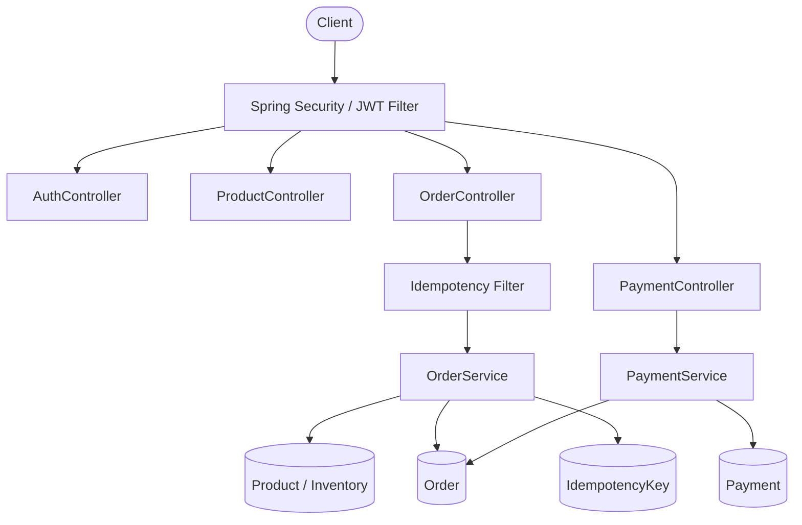
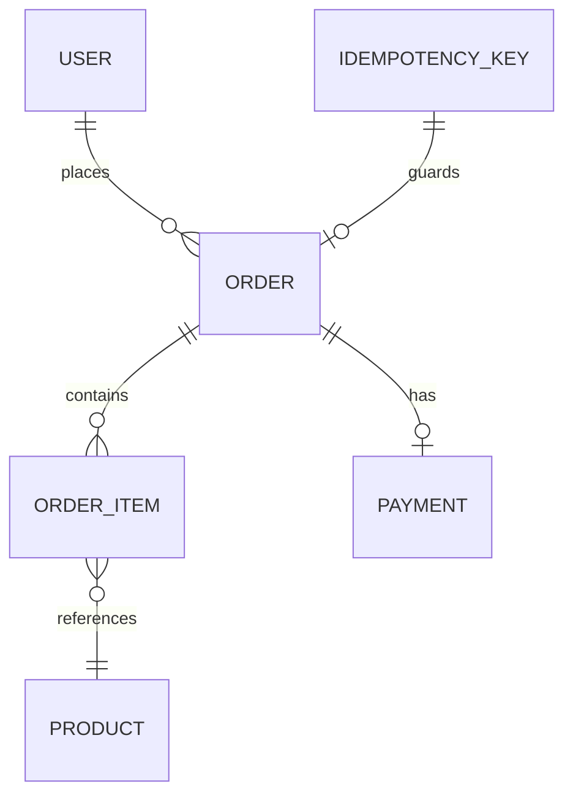

# Order & Payment Processing Platform

A Spring Boot REST API for processing e-commerce orders and payments reliably under real-world failure conditions: duplicate requests, concurrent inventory access, and payment failures.


---

## Table of Contents

1. [Overview](#overview)
2. [Features](#features)
3. [Architecture](#architecture)
4. [Tech Stack](#tech-stack)
5. [Quick Start](#quick-start)
6. [Configuration](#configuration)
7. [API Reference](#api-reference)
8. [Core Design](#core-design)
9. [Database Schema](#database-schema)
10. [Error Handling](#error-handling)
11. [Testing](#testing)
12. [Project Structure](#project-structure)
13. [Design Rationale](#design-rationale)
14. [Known Limitations](#known-limitations)
15. [Roadmap](#roadmap)
16. [License](#license)
17. [Author](#author)

---

## Overview

This service goes beyond CRUD to address the correctness problems that appear in production order systems:

| Concern | Approach |
|---------|----------|
| Duplicate requests | Idempotency keys with SHA-256 request fingerprinting |
| Concurrent stock updates | Optimistic locking via JPA `@Version` |
| Payment lifecycle | Explicit state machine with timestamped transitions |
| Partial failures | Transactional service methods with atomic rollback |
| Access control | Stateless JWT authentication with role-based authorization |

The idempotency and concurrency behaviors are covered by automated tests (see [Testing](#testing)).

---

## Features

**Authentication & Authorization**
- Stateless JWT authentication with BCrypt password hashing
- `USER` and `ADMIN` roles enforced at the endpoint level
- Requests with missing or invalid tokens are rejected

**Order Management**
- Multi-item orders with stock validation
- Price snapshot at purchase time, unaffected by later price changes
- Status lifecycle: `PENDING` → `CONFIRMED` / `FAILED`
- Users retrieve their own orders; admins can retrieve any order

**Inventory**
- Transactional stock deduction with rollback on failure
- Optimistic locking prevents overselling under concurrent load
- Insufficient stock returns `422 Unprocessable Entity`

**Idempotency**
- `Idempotency-Key` header required on `POST /api/orders`
- Replays with the same key and payload return the original response
- Reuse of a key with a different payload returns `409 Conflict`

**Payments**
- State machine: `PENDING` → `PROCESSING` → `SUCCESS` / `FAILED`
- Mock processor simulates success and failure outcomes
- Repeat payment calls on the same order are idempotent

**API Quality**
- Centralized exception handling via `@RestControllerAdvice`
- Field-level validation errors with `400 Bad Request`
- OpenAPI documentation via Swagger UI

---

## Architecture



### Entity Relationships



The codebase follows a layered architecture (Controller → Service → Repository) with DTOs at the API boundary and constructor-based dependency injection.

---

## Tech Stack

| Layer | Technology |
|-------|-----------|
| Language | Java 21 |
| Framework | Spring Boot 4.1.0, Spring MVC |
| Persistence | Spring Data JPA, Hibernate, MySQL 8.0 |
| Security | Spring Security, JJWT 0.12.5 |
| Validation | Jakarta Bean Validation |
| API Docs | springdoc-openapi (Swagger UI) |
| Testing | JUnit 5, Mockito |
| Containerization | Docker, Docker Compose |
| Build | Maven |

---

## Quick Start

### Option A: Docker Compose (recommended)

1. Create a `.env` file in the project root:

   ```env
   DB_PASSWORD=your_password
   APP_JWT_SECRET=your_jwt_secret_key
   ```

2. Start the stack:

   ```bash
   docker compose up --build
   ```

This builds the application image, starts MySQL 8.0 with a persistent volume, waits for the database healthcheck, then starts the API.

```bash
docker compose down        # stop containers
docker compose down -v     # stop containers and delete the database volume
```

### Option B: Run locally

**Prerequisites:** Java 21, Maven, MySQL 8.0

```bash
# 1. Clone
git clone https://github.com/Shreyas-Kumbhar/order-payment-platform.git
cd order-payment-platform

# 2. Create the database
mysql -u root -p -e "CREATE DATABASE order_payment_db;"

# 3. Set environment variables (macOS/Linux)
export DB_PASSWORD=your_mysql_password
export APP_JWT_SECRET=your_256_bit_secret

# 4. Run
./mvnw spring-boot:run
```

On Windows PowerShell, set variables with `$env:DB_PASSWORD="..."` and use `mvnw.cmd`.

Swagger UI: <http://localhost:8080/swagger-ui/index.html>

---

## Configuration

| Variable | Description |
|----------|-------------|
| `DB_PASSWORD` | MySQL root password |
| `APP_JWT_SECRET` | JWT signing key (minimum 256 bits) |

Mapped in `application.properties`:

```properties
spring.datasource.password=${DB_PASSWORD}
app.jwt.secret=${APP_JWT_SECRET}
```

> **Security:** Never commit secrets. `.env` is excluded via `.gitignore`.

---

## API Reference

| Method | Endpoint | Description | Auth | Role |
|--------|----------|-------------|:----:|------|
| `POST` | `/api/auth/register` | Register a new user | No | — |
| `POST` | `/api/auth/login` | Authenticate and receive a JWT | No | — |
| `GET` | `/api/products` | List products | No | — |
| `GET` | `/api/products/{id}` | Get a product | No | — |
| `POST` | `/api/products` | Create a product | Yes | ADMIN |
| `PUT` | `/api/products/{id}` | Update a product | Yes | ADMIN |
| `POST` | `/api/orders` | Place an order | Yes | USER |
| `GET` | `/api/orders` | List the current user's orders | Yes | USER |
| `GET` | `/api/orders/{id}` | Get an order | Yes | USER / ADMIN |
| `POST` | `/api/payments/{orderId}` | Process payment for an order | Yes | USER |
| `GET` | `/api/payments/{id}` | Get a payment | Yes | USER |

### Authentication

**Register**

```http
POST /api/auth/register
Content-Type: application/json

{
  "username": "shreyas",
  "email": "shreyas@example.com",
  "password": "password123"
}
```

**Login**

```http
POST /api/auth/login
Content-Type: application/json

{
  "username": "shreyas",
  "password": "password123"
}
```

```json
{
  "token": "<JWT_TOKEN>",
  "username": "shreyas",
  "role": "USER"
}
```

Include the token on authenticated requests. Tokens expire after 24 hours.

```http
Authorization: Bearer <JWT_TOKEN>
```

### Place an Order

```http
POST /api/orders
Authorization: Bearer <JWT_TOKEN>
Idempotency-Key: 550e8400-e29b-41d4-a716-446655440000
Content-Type: application/json

{
  "orderItems": [
    { "productId": 1, "quantity": 2 },
    { "productId": 3, "quantity": 1 }
  ]
}
```

**`201 Created`**

```json
{
  "id": 42,
  "status": "PENDING",
  "totalAmount": 149.97,
  "items": [
    { "productId": 1, "productName": "Keyboard", "quantity": 2, "purchaseAtPrice": 49.99 },
    { "productId": 3, "productName": "Mouse", "quantity": 1, "purchaseAtPrice": 49.99 }
  ],
  "createdAt": "2026-10-02T19:00:00"
}
```

| Scenario | Response |
|----------|----------|
| Same key, same payload | `200 OK` with the original response; no new order created |
| Same key, different payload | `409 Conflict` |
| Missing `Idempotency-Key` header | `400 Bad Request` |

### Process Payment

```http
POST /api/payments/42
Authorization: Bearer <JWT_TOKEN>
```

**`200 OK`**

```json
{
  "id": 1,
  "status": "SUCCESS",
  "orderId": 42,
  "amount": 149.97,
  "failureReason": null,
  "createdAt": "2026-10-02T19:00:01",
  "updatedAt": "2026-10-02T19:00:01"
}
```

---

## Core Design

### Idempotency

Network failures and client retries can deliver the same request more than once. Without safeguards, a retry could create duplicate orders or charge a customer twice.

Processing flow for `POST /api/orders`:

1. **Header check:** `IdempotencyFilter` rejects requests without an `Idempotency-Key` (`400`).
2. **Fingerprinting:** `OrderService` computes a SHA-256 hash of the payload (product IDs and quantities).
3. **Lookup:** the `idempotency_keys` table is checked for the key.
4. **Same key, same hash:** the original response is returned without reprocessing.
5. **Same key, different hash:** the request is rejected with `409 Conflict`.
6. **New key:** the order is processed and the key, hash, and order ID are stored.

### Concurrency & Optimistic Locking

Without protection, two users ordering the last unit simultaneously can both read `stockQuantity = 1`, both pass the check, and both deduct stock, leaving `-1`.

`Product` carries a Hibernate-managed version field:

```java
@Version
private Integer version;
```

The first transaction to commit increments the version. The second detects the mismatch, fails with an optimistic lock exception, and is mapped to `409 Conflict` by `GlobalExceptionHandler`. No database lock is held for the duration of the transaction.

### Payment State Machine

```
PENDING → PROCESSING → SUCCESS
                     → FAILED
```

| State | Meaning |
|-------|---------|
| `PENDING` | Payment record created |
| `PROCESSING` | Payment processor invoked |
| `SUCCESS` | Payment confirmed; order moves to `CONFIRMED` |
| `FAILED` | Payment declined; order moves to `FAILED`; failure reason stored |

Transitions are timestamped via `@PreUpdate`. Calling `POST /api/payments/{orderId}` on an already-processed order returns the existing payment without reprocessing.

---

## Database Schema

| Table | Key Columns | Notes |
|-------|-------------|-------|
| `users` | `id`, `username`, `email`, `password`, `role` | BCrypt hashes; unique username and email |
| `products` | `id`, `name`, `price`, `stock_quantity`, `version` | `version` supports optimistic locking |
| `orders` | `id`, `user_id`, `order_status`, `total_amount`, `created_at` | FK to `users` |
| `order_items` | `id`, `order_id`, `product_id`, `quantity`, `purchase_at_price` | Price snapshot at purchase |
| `payments` | `id`, `order_id`, `payment_status`, `amount`, `failure_reason`, `created_at`, `updated_at` | One-to-one with order |
| `idempotency_keys` | `id`, `idempotency_key`, `request_hash`, `response_body`, `status` | Unique constraint on key |

The schema is managed by Hibernate (`ddl-auto=update`). Versioned migrations are recommended for production (see [Roadmap](#roadmap)).

---

## Error Handling

`GlobalExceptionHandler` (`@RestControllerAdvice`) maps exceptions to HTTP responses:

| Exception | Status | Meaning |
|-----------|--------|---------|
| `MethodArgumentNotValidException` | `400 Bad Request` | Validation failure (field-level errors) |
| `ResourceNotFoundException` | `404 Not Found` | Entity not found |
| `IllegalArgumentException` | `404 Not Found` | General not-found case |
| `IdempotencyConflictException` | `409 Conflict` | Same key, different payload |
| `OptimisticLockException` | `409 Conflict` | Concurrent update conflict |
| `IllegalStateException` | `409 Conflict` | General conflict case |
| `InsufficientStockException` | `422 Unprocessable Entity` | Not enough stock |
| `Exception` | `500 Internal Server Error` | Unhandled; logged |

---

## Testing

```bash
./mvnw test
```

15 tests, all passing. Unit tests use Mockito and require no database.

| Test Class | Tests | Coverage |
|------------|:-----:|----------|
| `ProductServiceTest` | 4 | Create, get by ID (found / not found), partial update |
| `OrderServiceTest` | 4 | Total calculation, insufficient stock, idempotent replay, conflict detection |
| `PaymentServiceTest` | 3 | Success / failure outcomes, duplicate prevention, order not found |
| `IdempotencyFilterTest` | 2 | Missing header → 400; present header passes through |
| `OrderConcurrencyTest` | 1 | Two threads racing for the last unit; only one succeeds |
| `OrderPaymentPlatformApplicationTests` | 1 | Spring context loads |

The concurrency test uses `ExecutorService`, `CountDownLatch`, and `AtomicInteger` to maximize thread contention.

---

## Project Structure

```text
src/
├── main/
│   ├── java/com/shreyas/order_payment_platform/
│   │   ├── config/          # SecurityConfig: filter chain and role rules
│   │   ├── controller/      # Auth, Order, Payment, Product, User
│   │   ├── dto/
│   │   │   ├── requests/    # Login, Register, Order, OrderItem, Product
│   │   │   └── responses/   # Jwt, Order, OrderItem, Payment, Product, User
│   │   ├── entity/          # User, Product, Order, OrderItem, Payment, IdempotencyKey
│   │   │   └── enums/       # IdempotencyStatus, OrderStatus, PaymentStatus, Role
│   │   ├── exception/       # GlobalExceptionHandler and domain exceptions
│   │   ├── filter/          # IdempotencyFilter: header presence guard
│   │   ├── repository/      # Spring Data JPA repositories
│   │   ├── security/        # JWT filter, token provider, UserDetailsService
│   │   └── service/         # Auth, Order, Payment, Product, User
│   └── resources/
│       └── application.properties
└── test/
    └── java/com/shreyas/order_payment_platform/
        ├── filter/          # IdempotencyFilterTest
        ├── service/         # Order, OrderConcurrency, Payment, Product tests
        └── OrderPaymentPlatformApplicationTests.java
```

---

## Design Rationale

**Idempotency keys.** A timeout does not mean a request failed; it may have succeeded server-side. The `Idempotency-Key` pattern makes retries safe without requiring clients to query for existing orders first.

**Optimistic locking.** Pessimistic row locks are held for the duration of a transaction and limit throughput. For inventory where most requests succeed, detecting conflicts at commit time is the better tradeoff.

**JWT.** Tokens let the server verify identity and role without a session store or per-request database lookup, and tampering is detectable through the signature.

**Payment state machine.** An enum-based lifecycle, rather than a boolean `paid` flag, preserves failure reasons and timestamps, so payment history can be audited after the fact.

**Docker Compose.** A single command reproduces the full stack, removing environment differences between machines.

---

## Known Limitations

- **Concurrent duplicates.** Idempotency handling covers sequential retries. Truly simultaneous requests with the same key are not protected by distributed locking.
- **Mock payment processor.** Payment outcomes are simulated; no real payment gateway is integrated.
- **Schema management.** `ddl-auto=update` is used instead of versioned migrations.
- **Unit-test scope.** Tests run against mocks; no integration tests against a real database yet.

---

## Roadmap

- [ ] Redis-based distributed idempotency for concurrent duplicate protection
- [ ] Flyway or Liquibase schema migrations
- [ ] Testcontainers integration tests against MySQL
- [ ] CI/CD pipeline (automated tests and Docker image builds)
- [ ] Kafka event-driven payment processing
- [ ] Refresh token rotation
- [ ] Rate limiting
- [ ] Distributed tracing and request correlation
- [ ] Cloud deployment (Render, Railway, or AWS ECS)

---

## License

Distributed under the MIT License. See [LICENSE](LICENSE) for details.

---

## Author

**Shreyas Rajesh Kumbhar**, Java Backend Developer

[GitHub](https://github.com/Shreyas-Kumbhar) · [LinkedIn](https://linkedin.com/in/ShreyasKumbhar09) · [Portfolio](https://shreyas-kumbhar.github.io/Personal-Portfolio/) · [LeetCode](https://leetcode.com/ShreyasKumbhar09) · [Email](mailto:kumbharshreyas07@gmail.com)


<div align="center">

Built with ❤️ by Shreyas Kumbhar

</div>
