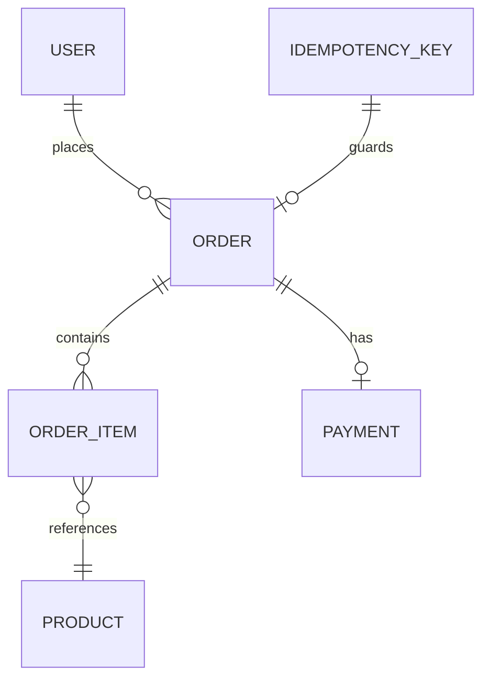

# Order & Payment Processing Platform

A Spring Boot REST API backend focused on backend engineering depth: idempotent request handling, concurrency-safe inventory management, a payment state machine, and JWT-secured role-based access control.


---

## Table of Contents

- [Project Overview](#project-overview)
- [Architecture](#architecture)
- [Key Features](#key-features)
- [Tech Stack](#tech-stack)
- [Project Structure](#project-structure)
- [API Endpoints](#api-endpoints)
- [Authentication](#authentication)
- [Idempotency Design](#idempotency-design)
- [Concurrency & Optimistic Locking](#concurrency--optimistic-locking)
- [Payment State Machine](#payment-state-machine)
- [Database Design](#database-design)
- [Error Handling](#error-handling)
- [Testing](#testing)
- [Docker Setup](#docker-setup)
- [Environment Variables](#environment-variables)
- [Running Locally](#running-locally)
- [Example Requests](#example-requests)
- [Backend Engineering Concepts Demonstrated](#backend-engineering-concepts-demonstrated)
- [Design Decisions](#design-decisions)
- [Future Improvements](#future-improvements)
- [Why This Project Is Interesting](#why-this-project-is-interesting)
- [License](#license)
- [Author](#author)

---

## Project Overview

This project is a backend REST API that processes e-commerce orders and payments reliably under real-world failure conditions — duplicate requests, concurrent inventory access, and payment failures.

The core focus is not CRUD, but backend engineering depth:

- **Idempotency** — retried requests never create duplicate orders or double charges
- **Optimistic locking** — concurrent stock updates never oversell inventory
- **Payment state machine** — auditable payment lifecycle, not a boolean flag
- **Transaction integrity** — partial failures roll back atomically

---

## Architecture


### Entity Relationships



---

## Key Features

### Authentication & Authorization
- JWT-based stateless authentication
- BCrypt password hashing
- `USER` and `ADMIN` roles enforced at endpoint level
- Protected routes reject requests with missing or invalid tokens

### Order Management
- Create multi-item orders with stock validation
- Price snapshot at time of purchase (not affected by future price changes)
- Order status tracking: `PENDING` → `CONFIRMED` / `FAILED`
- Retrieve own orders (users) or any order (admins)

### Inventory Management
- Stock deduction is transactional — partial failures roll back
- Optimistic locking via JPA `@Version` prevents overselling under concurrent load
- Insufficient stock returns `422 Unprocessable Entity`

### Idempotency
- Every `POST /api/orders` requires an `Idempotency-Key` header
- SHA-256 request fingerprinting detects same-key-different-payload conflicts
- Duplicate requests return the original response without reprocessing
- Conflict reuse returns `409 Conflict`

### Payment Processing
- Payment state machine: `PENDING` → `PROCESSING` → `SUCCESS` / `FAILED`
- Mock payment processor simulates real-world success/failure outcomes
- Calling the payment endpoint twice on the same order is idempotent

### Exception Handling
- `@RestControllerAdvice` global handler maps all exceptions to correct HTTP status codes
- Validation errors return field-level error maps with `400 Bad Request`
- Business exceptions (`InsufficientStock`, `ResourceNotFound`, `IdempotencyConflict`) return meaningful messages

---

## Tech Stack

| Layer | Technology |
|-------|-----------|
| Language | Java 21 |
| Framework | Spring Boot 4.1.0 |
| Web | Spring MVC |
| Persistence | Spring Data JPA, Hibernate, MySQL 8.0 |
| Security | Spring Security, JWT (JJWT 0.12.5) |
| Validation | Jakarta Bean Validation |
| Testing | JUnit 5, Mockito |
| API Docs | springdoc-openapi (Swagger UI) |
| Containerization | Docker, Docker Compose |
| Build | Maven |

---

## Project Structure

```text
src/
├── main/
│   ├── java/com/shreyas/order_payment_platform/
│   │   ├── config/
│   │   │   └── SecurityConfig.java           # Security filter chain, role rules
│   │   ├── controller/
│   │   │   ├── AuthController.java           # Register, login
│   │   │   ├── OrderController.java          # Create, retrieve orders
│   │   │   ├── PaymentController.java        # Process, retrieve payments
│   │   │   ├── ProductController.java        # Product CRUD
│   │   │   └── UserController.java
│   │   ├── dto/
│   │   │   ├── requests/                     # LoginRequest, RegisterRequest,
│   │   │   │                                 # OrderRequest, OrderItemRequest,
│   │   │   │                                 # ProductRequests
│   │   │   └── responses/                    # JwtResponse, OrderResponse,
│   │   │                                     # PaymentResponse, ProductResponse,
│   │   │                                     # OrderItemResponse, UserResponse
│   │   ├── entity/
│   │   │   ├── enums/
│   │   │   │   ├── IdempotencyStatus.java
│   │   │   │   ├── OrderStatus.java
│   │   │   │   ├── PaymentStatus.java
│   │   │   │   └── Role.java
│   │   │   ├── IdempotencyKey.java
│   │   │   ├── Order.java
│   │   │   ├── OrderItem.java
│   │   │   ├── Payment.java
│   │   │   ├── Product.java
│   │   │   └── User.java
│   │   ├── exception/
│   │   │   ├── GlobalExceptionHandler.java
│   │   │   ├── IdempotencyConflictException.java
│   │   │   ├── InsufficientStockException.java
│   │   │   └── ResourceNotFoundException.java
│   │   ├── filter/
│   │   │   └── IdempotencyFilter.java        # Header presence guard
│   │   ├── repository/
│   │   │   ├── IdempotencyKeyRepository.java
│   │   │   ├── OrderRepository.java
│   │   │   ├── PaymentRepository.java
│   │   │   ├── ProductRepository.java
│   │   │   └── UserRepository.java
│   │   ├── security/
│   │   │   ├── CustomUserDetailsService.java
│   │   │   ├── JwtAuthentication.java        # JWT filter (OncePerRequestFilter)
│   │   │   └── JwtTokenProvider.java         # Token generation and validation
│   │   └── service/
│   │       ├── AuthService.java
│   │       ├── OrderService.java
│   │       ├── PaymentService.java
│   │       ├── ProductService.java
│   │       └── UserService.java
│   └── resources/
│       └── application.properties
└── test/
    └── java/com/shreyas/order_payment_platform/
        ├── filter/
        │   └── IdempotencyFilterTest.java
        ├── service/
        │   ├── OrderConcurrencyTest.java
        │   ├── OrderServiceTest.java
        │   ├── PaymentServiceTest.java
        │   └── ProductServiceTest.java
        └── OrderPaymentPlatformApplicationTests.java
```

---

## API Endpoints

| Method | Endpoint | Description | Auth Required | Role |
|--------|----------|-------------|---------------|------|
| `POST` | `/api/auth/register` | Register a new user | No | — |
| `POST` | `/api/auth/login` | Authenticate and receive JWT | No | — |
| `GET` | `/api/products` | List all products | No | — |
| `GET` | `/api/products/{id}` | Get product by ID | No | — |
| `POST` | `/api/products` | Create a product | Yes | ADMIN |
| `PUT` | `/api/products/{id}` | Update a product | Yes | ADMIN |
| `POST` | `/api/orders` | Place an order | Yes | USER |
| `GET` | `/api/orders` | Get current user's orders | Yes | USER |
| `GET` | `/api/orders/{id}` | Get order by ID | Yes | USER / ADMIN |
| `POST` | `/api/payments/{orderId}` | Process payment for an order | Yes | USER |
| `GET` | `/api/payments/{id}` | Get payment by ID | Yes | USER |

Swagger UI is available at: `http://localhost:8080/swagger-ui/index.html`

---

## Authentication

### Register

```http
POST /api/auth/register
Content-Type: application/json

{
  "username": "shreyas",
  "email": "shreyas@example.com",
  "password": "password123"
}
```

### Login

```http
POST /api/auth/login
Content-Type: application/json

{
  "username": "shreyas",
  "password": "password123"
}
```

**Response:**

```json
{
  "token": "<JWT_TOKEN>",
  "username": "shreyas",
  "role": "USER"
}
```

### Using the Token

Add the token to all authenticated requests:

```http
Authorization: Bearer <JWT_TOKEN>
```

Tokens expire after 24 hours. A new token must be obtained via login.

---

## Idempotency Design

### Why Idempotency Matters

Network failures, timeouts, and client retries can cause the same request to reach the server more than once. Without idempotency, a retry could:

- Create two orders from one user action
- Charge a customer twice for the same purchase

### How It Works

Every `POST /api/orders` request must include an `Idempotency-Key` header — a unique string generated by the client (e.g. a UUID).

```
POST /api/orders
Idempotency-Key: 550e8400-e29b-41d4-a716-446655440000
Authorization: Bearer <JWT_TOKEN>
```

The system processes the key as follows:

1. **Header check** — `IdempotencyFilter` rejects requests with a missing header (`400 Bad Request`)
2. **Request fingerprinting** — `OrderService` SHA-256 hashes the request payload (product IDs + quantities)
3. **Key lookup** — checks the `idempotency_keys` table for an existing record with this key
4. **Duplicate detected, same payload** — returns the original order response without reprocessing
5. **Duplicate detected, different payload** — rejects with `409 Conflict`
6. **New request** — processes the order normally and stores the key + hash + order ID

### What Is NOT Claimed

This implementation handles sequential duplicate requests. It does not use distributed locking (e.g. Redis) to protect against truly simultaneous concurrent duplicates with the same key. That is listed as a future improvement.

---

## Concurrency & Optimistic Locking

### The Problem

When two users simultaneously order the last unit of a product:

1. Both transactions read `stockQuantity = 1`
2. Both pass the stock check
3. Both deduct stock — resulting in `stockQuantity = -1` (oversold)

### The Solution

The `Product` entity has a `@Version` field managed by Hibernate:

```java
@Version
private Integer version;
```

When two transactions attempt to update the same product row:

- The first to commit increments the version
- The second finds the version has changed and throws `OptimisticLockException`
- The exception is caught by `GlobalExceptionHandler` and returned as `409 Conflict`

This prevents overselling without holding a database lock for the duration of the transaction.

---

## Payment State Machine

Payment status follows a strict lifecycle:

```
PENDING → PROCESSING → SUCCESS
                     → FAILED
```

- `PENDING` — payment record created
- `PROCESSING` — payment processor invoked
- `SUCCESS` — payment confirmed, order moved to `CONFIRMED`
- `FAILED` — payment declined, order moved to `FAILED`, failure reason stored

Each transition is timestamped via `@PreUpdate`. Calling `POST /api/payments/{orderId}` on an already-processed order returns the existing payment without reprocessing (idempotent).

---

## Database Design

| Table | Key Columns | Notes |
|-------|-------------|-------|
| `users` | `id`, `username`, `email`, `password`, `role` | BCrypt password, unique username/email |
| `products` | `id`, `name`, `price`, `stock_quantity`, `version` | `version` for optimistic locking |
| `orders` | `id`, `user_id`, `order_status`, `total_amount`, `created_at` | FK to users |
| `order_items` | `id`, `order_id`, `product_id`, `quantity`, `purchase_at_price` | Price snapshot at purchase time |
| `payments` | `id`, `order_id`, `payment_status`, `amount`, `failure_reason`, `created_at`, `updated_at` | One-to-one with order |
| `idempotency_keys` | `id`, `idempotency_key`, `request_hash`, `response_body`, `status` | Unique key constraint |

Schema is managed by Hibernate `ddl-auto=update`. For production use, Flyway or Liquibase migrations are recommended.

---

## Error Handling

All exceptions are handled centrally by `GlobalExceptionHandler` (`@RestControllerAdvice`):

| Exception | HTTP Status | Description |
|-----------|-------------|-------------|
| `ResourceNotFoundException` | `404 Not Found` | Entity not found by ID |
| `InsufficientStockException` | `422 Unprocessable Entity` | Not enough stock |
| `IdempotencyConflictException` | `409 Conflict` | Same key, different payload |
| `OptimisticLockException` | `409 Conflict` | Concurrent update conflict |
| `MethodArgumentNotValidException` | `400 Bad Request` | Bean validation failure (field-level errors) |
| `IllegalArgumentException` | `404 Not Found` | General not-found case |
| `IllegalStateException` | `409 Conflict` | General conflict case |
| `Exception` | `500 Internal Server Error` | Unhandled exceptions (logged) |

---

## Testing

15 tests, all passing.

```bash
./mvnw test
```

| Test Class | Tests | What Is Covered |
|------------|-------|-----------------|
| `ProductServiceTest` | 4 | Create product, get by ID (found/not found), partial update |
| `OrderServiceTest` | 4 | Total calculation, insufficient stock, idempotent replay, conflict detection |
| `IdempotencyFilterTest` | 2 | Missing header → 400, present header → passes through |
| `OrderConcurrencyTest` | 1 | Two threads racing for last stock — only one succeeds |
| `PaymentServiceTest` | 3 | Success/failure outcome, duplicate prevention, order not found |
| `OrderPaymentPlatformApplicationTests` | 1 | Spring context loads successfully |

All unit tests use Mockito — no database required. The concurrency test uses `ExecutorService` and `CountDownLatch` to maximize thread collision.

---

## Docker Setup

The full stack (application + MySQL) runs with a single command:

```bash
docker compose up --build
```

This will:
1. Build the application JAR inside a Docker build stage
2. Start a MySQL 8.0 container with a persistent volume
3. Wait for MySQL to pass its healthcheck before starting the app
4. Start the Spring Boot application connected to the MySQL container

To stop and remove containers:

```bash
docker compose down
```

To stop and remove containers **including the database volume**:

```bash
docker compose down -v
```

> MySQL data is persisted in a named Docker volume (`mysql_data`). Removing the volume deletes all data.

---

## Environment Variables

The application requires two secrets at runtime. These must never be committed to version control.

| Variable | Description |
|----------|-------------|
| `DB_PASSWORD` | MySQL root password |
| `APP_JWT_SECRET` | Secret key for JWT signing (minimum 256-bit) |

**Setting environment variables on your system:**

Windows (PowerShell):
```powershell
$env:DB_PASSWORD="your_password"
$env:APP_JWT_SECRET="your_jwt_secret_key"
```

macOS/Linux:
```bash
export DB_PASSWORD=your_password
export APP_JWT_SECRET=your_jwt_secret_key
```

**How they are used in the application:**

```properties
spring.datasource.password=${DB_PASSWORD}
app.jwt.secret=${APP_JWT_SECRET}
```

**Using a `.env` file (optional, for Docker only):**

Create a `.env` file at the project root:
```env
DB_PASSWORD=your_password
APP_JWT_SECRET=your_jwt_secret_key
```

> `.env` is listed in `.gitignore` and must never be committed to GitHub.

---

## Running Locally

### Prerequisites

- Java 21
- MySQL 8.0 (or Docker)
- Maven

### Steps

**1. Clone the repository**

```bash
git clone https://github.com/Shreyas-Kumbhar/order-payment-platform.git
cd order-payment-platform
```

**2. Create the database**

```sql
CREATE DATABASE order_payment_db;
```

**3. Set environment variables**

```bash
export DB_PASSWORD=your_mysql_password
export APP_JWT_SECRET=your_256_bit_secret
```

**4. Build the project**

```bash
./mvnw clean package -DskipTests
```

Windows:
```bash
mvnw.cmd clean package -DskipTests
```

**5. Run the application**

```bash
./mvnw spring-boot:run
```

**6. Access Swagger UI**

```
http://localhost:8080/swagger-ui/index.html
```

---

## Example Requests

### Place an Order

```http
POST /api/orders
Authorization: Bearer <JWT_TOKEN>
Idempotency-Key: 550e8400-e29b-41d4-a716-446655440000
Content-Type: application/json

{
  "orderItems": [
    { "productId": 1, "quantity": 2 },
    { "productId": 3, "quantity": 1 }
  ]
}
```

**Response `201 Created`:**

```json
{
  "id": 42,
  "status": "PENDING",
  "totalAmount": 149.97,
  "items": [
    { "productId": 1, "productName": "Laptop", "quantity": 2, "purchaseAtPrice": 49.99 },
    { "productId": 3, "productName": "Mouse", "quantity": 1, "purchaseAtPrice": 49.99 }
  ],
  "createdAt": "2026-10-02T19:00:00"
}
```

**Retry with same key and payload → `200 OK`** (same response, no new order created)

**Retry with same key but different payload → `409 Conflict`**

```json
"Idempotency key already used with a different request payload."
```

### Process Payment

```http
POST /api/payments/42
Authorization: Bearer <JWT_TOKEN>
```

**Response `200 OK`:**

```json
{
  "id": 1,
  "status": "SUCCESS",
  "orderId": 42,
  "amount": 149.97,
  "failureReason": null,
  "createdAt": "2026-10-02T19:00:01",
  "updatedAt": "2026-10-02T19:00:01"
}
```

---

## Backend Engineering Concepts Demonstrated

| Concept | How It Is Used |
|---------|---------------|
| REST API design | Standard HTTP methods, status codes, and resource-based URLs |
| Layered architecture | Controller → Service → Repository, with DTOs crossing boundaries |
| Dependency injection | Spring `@Service`, `@Repository`, constructor injection via Lombok `@RequiredArgsConstructor` |
| JPA / Hibernate | Entity mapping, relationships, `@PrePersist`, `@PreUpdate`, `@Version` |
| Transaction management | `@Transactional` on service methods; partial failures roll back all DB changes |
| Optimistic locking | `@Version` on `Product` prevents concurrent overselling |
| Idempotency | SHA-256 request fingerprinting + `idempotency_keys` table |
| Authentication | JWT filter validates tokens on every request via `OncePerRequestFilter` |
| Authorization | `@EnableWebSecurity` + `HttpSecurity` rules per HTTP method and path |
| Input validation | Jakarta Bean Validation (`@NotBlank`, `@Email`, `@Min`, `@NotNull`) |
| Exception handling | `@RestControllerAdvice` maps domain exceptions to HTTP responses |
| Unit testing | JUnit 5 + Mockito, no Spring context, no database required |
| Mocking | `@Mock`, `@InjectMocks`, `when/thenReturn`, `thenAnswer`, `verify` |
| Concurrent testing | `ExecutorService`, `CountDownLatch`, `AtomicInteger` |
| Docker | Multi-stage Dockerfile, docker-compose with healthcheck and named volume |
| Database persistence | MySQL with Hibernate schema management |

---

## Design Decisions

### Why Idempotency?

Order and payment APIs are invoked over unreliable networks. A timeout does not mean the request failed — it may have succeeded on the server side. Without idempotency, a client retry creates a second order and a second charge. The `Idempotency-Key` pattern solves this at the API layer without requiring the client to check for existing orders before retrying.

### Why Optimistic Locking?

Pessimistic locking (database row locks) holds a lock for the duration of a transaction, limiting throughput. Optimistic locking assumes conflicts are rare — it reads without locking and only checks for conflicts at commit time. For an inventory system where most requests succeed, this is a better tradeoff.

### Why JWT?

REST APIs are stateless by design. JWT allows the server to verify identity and role from the token alone, without a session store or database lookup on every request. The token is signed with a secret key, so tampering is detectable.

### Why Docker Compose?

Docker Compose makes the entire stack (application + database) reproducible with a single command. It eliminates "works on my machine" problems and makes the project easier for anyone to run locally.

### Why a Payment State Machine?

Storing payment status as an enum with `PENDING → PROCESSING → SUCCESS/FAILED` transitions (rather than a boolean `paid` flag) makes the payment lifecycle auditable. Each state is timestamped, failure reasons are preserved, and the history is inspectable after the fact.

---

## Future Improvements

The following are planned improvements, not current features:

- **Redis-based distributed idempotency** — protect against concurrent duplicate requests with the same key
- **Kafka event-driven payment processing** — decouple payment processing from order creation
- **Flyway/Liquibase migrations** — replace `ddl-auto=update` with versioned schema migrations
- **Testcontainers integration tests** — test against a real MySQL instance in CI
- **CI/CD pipeline** — automated testing and Docker image builds on push
- **Refresh token rotation** — extend JWT sessions without full re-authentication
- **Rate limiting** — protect endpoints from abuse
- **Distributed tracing** — request correlation across service boundaries
- **Cloud deployment** — Render, Railway, or AWS ECS free tier

---

## Why This Project Is Interesting

Most CRUD applications do not surface the engineering challenges that appear in real backend systems. This project deliberately targets those challenges:

- **Duplicate requests** — What happens when a mobile client retries an order after a timeout? This project handles it correctly.
- **Concurrent inventory** — What happens when two users buy the last item simultaneously? This project prevents overselling.
- **Transaction consistency** — What happens if stock deduction succeeds but the order save fails? This project rolls back atomically.
- **Auditable payments** — What does the payment history look like after a failure? This project preserves it.
- **Testable claims** — The idempotency and concurrency guarantees are not just comments in the code — they are proven by automated tests.

These are the kinds of problems that come up in backend engineering interviews, and this project provides concrete, demonstrable answers.

---

## License

[MIT License](LICENSE)

```
MIT License

Copyright (c) 2026 Shreyas Kumbhar

Permission is hereby granted, free of charge, to any person obtaining a copy
of this software and associated documentation files (the "Software"), to deal
in the Software without restriction, including without limitation the rights
to use, copy, modify, merge, publish, distribute, sublicense, and/or sell
copies of the Software, and to permit persons to whom the Software is
furnished to do so, subject to the following conditions:

The above copyright notice and this permission notice shall be included in all
copies or substantial portions of the Software.

THE SOFTWARE IS PROVIDED "AS IS", WITHOUT WARRANTY OF ANY KIND, EXPRESS OR
IMPLIED, INCLUDING BUT NOT LIMITED TO THE WARRANTIES OF MERCHANTABILITY,
FITNESS FOR A PARTICULAR PURPOSE AND NONINFRINGEMENT. IN NO EVENT SHALL THE
AUTHORS OR COPYRIGHT HOLDERS BE LIABLE FOR ANY CLAIM, DAMAGES OR OTHER
LIABILITY, WHETHER IN AN ACTION OF CONTRACT, TORT OR OTHERWISE, ARISING FROM,
OUT OF OR IN CONNECTION WITH THE SOFTWARE OR THE USE OR OTHER DEALINGS IN THE
SOFTWARE.
```

---

## Author

**Shreyas Kumbhar**

GitHub: [https://github.com/Shreyas-Kumbhar](https://github.com/Shreyas-Kumbhar)

---

<div align="center">

Built with ❤️ by Shreyas Kumbhar

</div>
